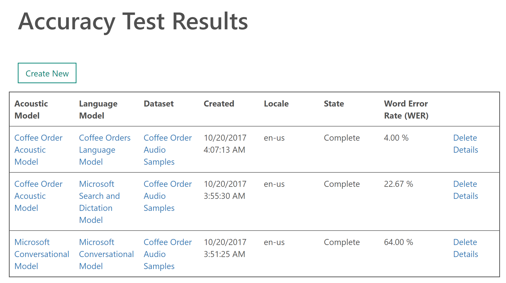

# B2B_CognitiveServices
This repository is the basis for a workshop on Microsoft Cognitive Services run at the Readify Back 2 Base event.

## Overview

We're going to build a Barista that can take coffee orders in natural language. We'll start simple and keep building on it until we run out of time.

Cognitive Services that we'll use in order - i.e. we may run out of time to implement all of them:

__Language: [LUIS](https://azure.microsoft.com/en-us/services/cognitive-services/language-understanding-intelligent-service/)__

Will interpret the order and pull it apart to work out exactly what you want. 

__Language: [Bing Spell Check Service](https://azure.microsoft.com/en-us/services/cognitive-services/spell-check/)__ 

Under the hood LUIS can also automatically use spell checking to cater for spelling mistakes.

__Speech: [Bing Speech API]() - Speech Recognition__

Add on speech recognition to the app so we can talk to our barista to order a coffee.

__Speech: [Bing Custom Speech]() - Better Speech Recognition__

Customise the speech recognition for our cafe domain to get better results.

__Speech: [Bing Speech API]() - Text to Speech__

Lets get our barista to confirm the order by repeating the exact order back to us.


# Steps

1. Clone sample repo:

```git clone https://github.com/caseymarcallen/B2B_CognitiveServices.git```

## LUIS
2. Configure LUIS

    2.1. Go to: [www.luis.ai](www.luis.ai)

    2.2. Log in using your readify account

    2.3. Import an app and choose the `Back 2 Base Cafe.json` file in this repo: 

    2.4 Train and Publish your LUIS App to get an API you can call from the App: 

3. Configure App to use LUIS API.

    3.1 Open the solution in Visual Studio and edit `MainPage.xaml.cs` to set your AppID and SubscriptionKey as shown in the LUIS Website.

    3.2 Add the following API calling code to the `MakeLuisRequest()` method:
    ```
    var client = new HttpClient();
    client.DefaultRequestHeaders.Add("Ocp-Apim-Subscription-Key", LuisSubscriptionKey);
    var uri = $"https://westus.api.cognitive.microsoft.com/luis/v2.0/apps/{LuisAppId}?spellCheck=true&q={orderText}";
    var response = await client.GetAsync(uri);
    apiResponse = await response.Content.ReadAsStringAsync();
    ```

    3.2 Run the App and test it out by entering something like:
    ```Can I have a capucino and 2 Long Macs```

    Note the typo on "capucino".

## Bing Speech
4. Add Speech Recognition

    4.1 Add Nuget Package Reference: Search for `Microsoft.ProjectOxford.SpeechRecognition`. Note: Project Oxford is the Microsoft Research codename for these services before they were added to Azure and converted to Cognitive Services. You will find lots of references both in package names and namespaces within the code to 'ProjectOxford'

    4.2 Uncomment Section 2 - the Speech Recognition portion of the app

    4.3 Go to [Try Cognitive Services](https://azure.microsoft.com/en-us/try/cognitive-services/) and click on the Bing Speech API's `Get API Key` button. Sign in using a personal login (not your @readify email address)

    4.4 Set the `BingSpeechSubscriptionKey` to your new key value.

    4.5 Add the following API calling code to the `CreateMicrophoneClientWithIntent()` method:
    ```
    micClient =
        SpeechRecognitionServiceFactory.CreateMicrophoneClientWithIntent(
        "en-AU",
        BingSpeechSubscriptionKey,
        LuisAppId,
        LuisSubscriptionKey);
        micClient.AuthenticationUri = "";  
    ```

    4.6 Uncomment the `ListenToOrderButton` in `MainPage.xaml`

    4.7 Run the App and test it out by clicking the 'Say Order' button and saying something like:

    "```Can I have a cappuccino and 2 Long Macs```"

    Your results here may vary. It is using the basic language and acoustic models. To get better results we can create a custom speech endpoint.

## Custom Speech
5. Create a Bing Custom Speech Endpoint
    
    Custom Speech Endpoints can be created at https://cris.ai. However the steps involved in recording audio samples can be quite time consuming. So here is one I prepared earlier:

     

    Here we can see that my initial results produced an error rate of 64% whereby 2/3rds of the time it made some sort of mistake in interpreting what I said. By uploading a custom language model consisting of sample textual phrases this reduced down to 22% error rate. By then uploading an Acoustic Model with audio recordings of me saying those phrases along with text indicating exactly what I said, the error rate is now down to 4%.

    5.1 Uncomment section 2b in `MainPage.xaml.cs`

    5.2 Add the following API calling code to the 'CreateCustomMicrophoneClientWithIntent()' method.
    ```
    micClient =
        SpeechRecognitionServiceFactory.CreateMicrophoneClientWithIntent(
        "en-AU",
        CustomSpeechApiPrimaryKey,
        CustomSpeechApiSecondaryKey,
        LuisAppId,
        LuisSubscriptionKey,
        CustomSpeechApiUrl);  
    ``` 

    5.3 Change the method call in `ListenToOrderButton_Click()` to point to the new `CreateCustomMicrophoneClientWithIntent()` method so that the custom endpoint is used.
    
    5.4 Run the App and test it out again by clicking the 'Say Order' button and saying something like:

    "```Can I have a cappuccino and 2 Long Macs```"

    See if your results are any better now using this custom speech endpoint that has been trained on the domain language that it can expect.

## Bing Text to Speech

6. Now that Our app is understanding us, lets get it to talk back and confirm our order verbally too.

    6.1 Include the Bing Speech folder into the solution. This includes a bunch of helper classes to take care of formatting a valid API request and returning the audio as a stream. In particular we'll use the `Cortana.Speak()` helper method to actually make the API call.

    6.2 Uncomment section 3 - the Text to Speech Confirmation section in `MainPage.xaml.cs`.

    6.3 Add the following API calling code to the 'ConfirmOrderVerbally()' method.
    ```
    await cortana.Speak(CancellationToken.None, new Cortana.InputOptions()
    {
        RequestUri = new Uri("https://speech.platform.bing.com/synthesize"),
        Text = orderConfirmationText,
        VoiceType = Gender.Female,
        Locale = "en-US",
        VoiceName = "Microsoft Server Speech Text to Speech Voice (en-US, ZiraRUS)", // en-US knows how to say cappuccino properly (AU does not)
        OutputFormat = AudioOutputFormat.Riff16Khz16BitMonoPcm,
        AuthorizationToken = "Bearer " + accessToken,
    });
    ```

    6.4 Add the following line to the end of the `ShowCoffeeOrder()` method.

    ```
    await ConfirmOrderVerbally(coffeeOrderResult);
    ```

    6.5 Run the App and test it out again by clicking the 'Say Order' button and saying something like:

    "```Can I have a cappuccino and 2 Long Macs```"

    Cortana should now talk back to you and confirm your order.

# Future

Thats all we'll likely have time for in our short workshop, but future things to explore could be:

* Use Vision API to detect when there's a face standing in front of the app and auto verbally ask someone to place and order and go into listening mode so you don't have to click a button.
* Use Vision API to recognize individual faces and simply ask the person by name if they just want their regular order. Add a new LUIS intent of "Place Regular Order" that can recognise the users answers.
* ...

thanks for attending.

 :-)
