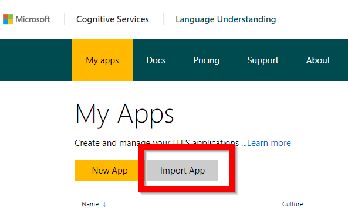
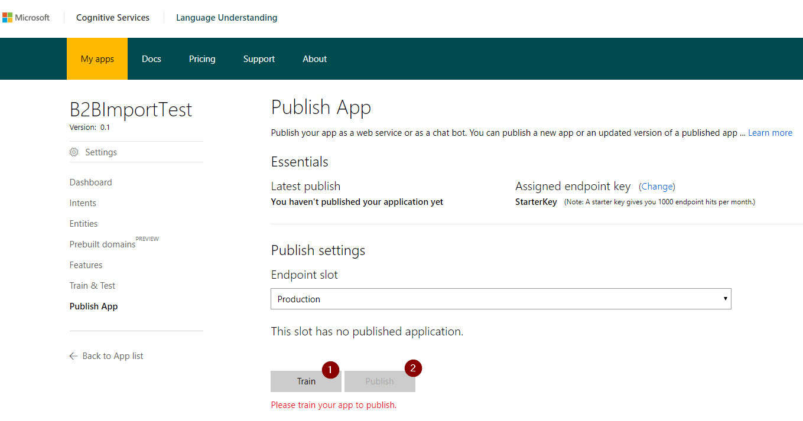

# B2B_CognitiveServices
This repository is the basis for a workshop on Microsoft Cognitive Services run at the Readify Back 2 Base event.

## Overview

We're going to build a Barista that can take coffee orders in natural language. We'll start simple and keep building on it until we run out of time.

Cognitive Services that we'll use in order - i.e. we may run out of time to implement all of them:

__Language: [LUIS](https://azure.microsoft.com/en-us/services/cognitive-services/language-understanding-intelligent-service/)__

Will interpret the order and pull it apart to work out exactly what you want. 

__Language: [Bing Spell Check Service](https://azure.microsoft.com/en-us/services/cognitive-services/spell-check/)__ 

Under the hood LUIS can also automatically use spell checking to cater for spelling mistakes.

__Speech: [Bing Speech API]() - Speech Recognition__

Add on speech recognition to the app so we can talk to our barista to order a coffee.

__Speech: [Bing Custom Speech]() - Better Speech Recognition__

Customise the speech recognition for our cafe domain to get better results.

__Speech: [Bing Speech API]() - Text to Speech__

Lets get our barista to confirm the order by repeating the exact order back to us.


# Steps

1. Clone sample repo:

```git clone https://github.com/caseymarcallen/B2B_CognitiveServices.git```

2. Configure LUIS

    2.1. Go to: [www.luis.ai](www.luis.ai)

    2.2. Log in using your readify account

    2.3. Import an app and choose the `Back 2 Base Cafe.json` file in this repo: 

    2.4 Train and Publish your LUIS App to get an API you can call from the App: 

3. Configure App to use LUIS API.

    3.1 Open the solution in Visual Studio and edit `MainPage.xaml.cs` to set your AppID and SubscriptionKey as shown in the LUIS Website.

    3.2 Add the following API calling code to the `MakeLuisRequest()` method:
    ```
    var client = new HttpClient();
    client.DefaultRequestHeaders.Add("Ocp-Apim-Subscription-Key", LuisSubscriptionKey);
    var uri = $"https://westus.api.cognitive.microsoft.com/luis/v2.0/apps/{LuisAppId}?spellCheck=true&q={orderText}";
    var response = await client.GetAsync(uri);
    apiResponse = await response.Content.ReadAsStringAsync();
    ```

    3.2 Run the App and test it out by entering something like:
    ```Can I have a capucino and 2 Long Macs```

4. Add Speech Recognition

    4.1 Double Click Package.appxmanifest and edit the Capabilities to check the `Microphone` checkbox.

    4.2 Add Nuget Package Reference: Search for `Microsoft.ProjectOxford.SpeechRecognition`. Note: Project Oxford is the Microsoft Research codename for these services before they were added to Azure and converted to Cognitive Services. You will find lots of references both in package names and namespaces within the code to 'ProjectOxford'
